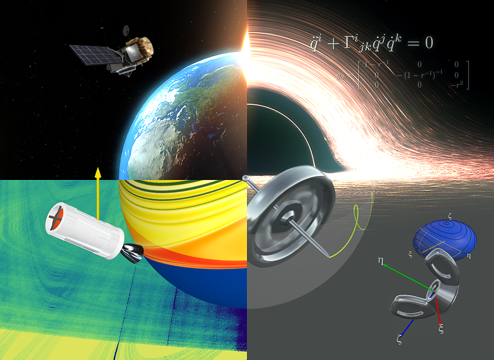

# Chaos and Cats
A course on Mathematical Modelling and Scientific Visualization

### [Web Page (WiP)](https://eltaurus-lt.github.io/ChaosAndCats/en/program.html)

[Source Files](https://github.com/Eltaurus-Lt/CnC)

[Old program (rus)](https://old.mipt.ru/education/chair/theoretical_mechanics/courses/haos-i-kotiki.php)
